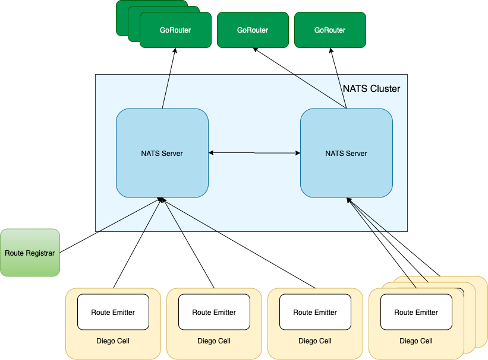
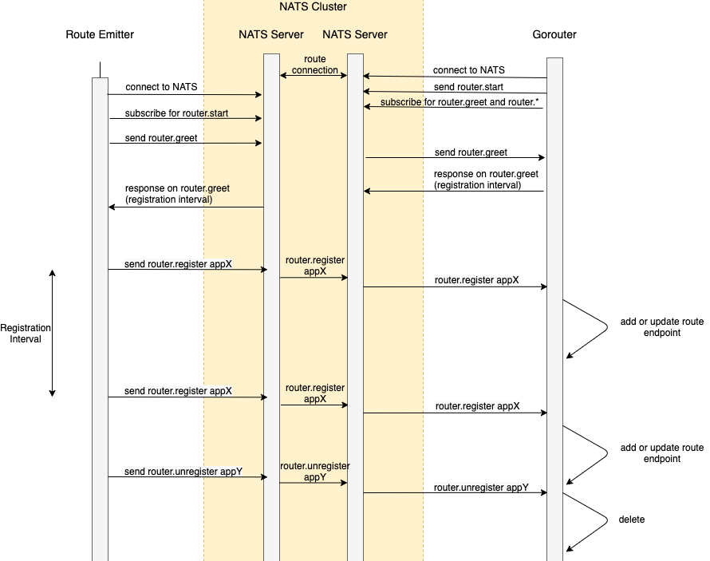

# NATS in Cloud Foundry
<!-- TOC -->

- [NATS in Cloud Foundry](#nats-in-cloud-foundry)
  - [Overview](#overview)
  - [Architecture](#architecture)
  - [Communication Flow](#communication-flow)
    - [Connection Establishment](#connection-establishment)
    - [Registeration / Unregisteration of the Application Routes in Cloud Foundry](#registeration--unregisteration-of-the-application-routes-in-cloud-foundry)
  - [NATS Server Configurations](#nats-server-configurations)
  - [Time Intervals and Timeouts](#time-intervals-and-timeouts)
    - [NATS Timeouts](#nats-timeouts)
    - [Gorouter Time Intervals](#gorouter-time-intervals)
    - [Route Registrar Intervals](#route-registrar-intervals)
  - [Debugging NATS in Cloud Foundry](#debugging-nats-in-cloud-foundry)
  - [Docs](#docs)

<!-- /TOC -->


## Overview

Cloud Foundry uses NATS as a publish-subscribe messaging system for exchanging routes and metrics configurations between components. The nats-release deploys NATS server as a bosh release to/from which the messages are consumed.

## Architecture


| Component | Description   |
|---|---|
| [Route Emitter](https://github.com/cloudfoundry/route-emitter) | A job that runs on the Diego Cell. It publishes(internal and external) app routes.|
| [Route Registrar](https://github.com/cloudfoundry/route-registrar) | Publishes route information for the system components.  |
| [NATS Server](https://github.com/nats-io/nats-server) | Receives the published routes from publishers and conveys then to subscribers.|
| [NATS Cluster](https://docs.nats.io/nats-server/configuration/clustering)  | The participating NATS Server listens on a cluster port and knows the other NATS Servers which join the cluster.|
| [Gorouter](https://github.com/cloudfoundry/gorouter) | Subscribes for the messages with subject "router.*". |
| [Service Discovery Controller](https://github.com/cloudfoundry/cf-networking-release/blob/develop/docs/service-discovery-architecture.md) | Subscribes to route updates from NATS on the internal routes subjects, "service-discovery.register", "service-discovery.unregister" and "service-discovery.greet" |
| [Metrics Discovery Registrar](https://github.com/cloudfoundry/metrics-discovery-release#metrics-discovery-registrar)  | Publishes scrape configs to CF NATS to be consumed by a Scrape Config Generator.|
| [Scrape Config Generator](https://github.com/cloudfoundry/metrics-discovery-release#scrape-config-generator)| Subscribes to CF NATS and consumes published metric targets.|

Note: The document will further focus on the external routing in Cloud Foundry.

## Communication Flow

### Connection Establishment

*Route Connections*

After the NATS Server is running, it tries to connect to the other NATS Servers of the cluster. This connection is named `Route connection` and begins with TLS route server handshake between NATS Servers. If the handshake takes too long, the timeout error will be thrown after 5s (#nats-timeouts). If the NATS Servers have been connected successfully, "Route connection created" will be logged.   

*Client Connections*

Clients (publishers or subscribers) establish client connections to NATS Server. Clients connecting to any server in the cluster will discover other servers in the cluster. If the connection to the server is interrupted, the client will attempt to connect to any of the other known servers.

### Registeration / Unregisteration of the Application Routes in Cloud Foundry

The Route Emitters connect to the random NATS Server from the cluster and waits "router.start" messages. When the Gorouter starts, it sends a "router.start" message to NATS Server. This message contains an interval named `minimumRegisterIntervalInSeconds` (configured by [requested_route_registration_interval_in_seconds](https://github.com/cloudfoundry/routing-release/blob/develop/jobs/gorouter/spec#L49)). After a "router.start" message is received by a route Emitter it sends every `minimumRegisterIntervalInSeconds` the route information about apps on the current Diego Cell. For new or existing apps the Route Emitter sends "router.register" messages and for the crashed apps "router.unregister" messages.

If a Route Emitter comes online after the Gorouter, it must make a NATS request called "router.greet" in order to determine the interval and then start to exchange messages via NATS.

Each NATS Server instance forwards messages that it has received from Route Emitters to the other NATS Server instances in the cluster. Messages received from a Route connection will only be distributed to local clients, e.g. Gorouter.

Upon receival of the registration/deregistration of app routes, Gorouter updates its routing table. If Gorouter doesn't receive a "router.register" message for an app within [`droplet_stale_threshold`](#gorouter-time-intervals), it prunes the route within the next pruning cycle (Note: pruning is performed to prevent misrouting, thus it is disabled when TLS/mTLS to Apps is enabled, as described [here](https://docs.cloudfoundry.org/concepts/http-routing.html#consistency))

The picture illustrates the communication flow described above.



## NATS Server Configurations

The nats-release currently offers two NATS jobs that can be colocated: a plain-text one (nats), which will be removed when all Cloud Foundry NATS clients are upgraded to use TLS, and a TLS one (nats-tls). The release guarantees that the non-tls clients (e.g. Gorouter) don't attempt to connect to the tls servers by setting the default value for `no_advertise` flag in nats-tls job to [`true`](https://github.com/cloudfoundry/nats-release/blob/a626be571d06b81004b247d58f5abf74a143346e/jobs/nats-tls/spec#L74). In this case the NATS Server configured by nats-tls job will not advertise its client IP to the other cluster participants. Only clients (e.g. Route Emitter) which know the tls server from their configuration will attempt to connect to it.

Aside from choosing to run nats or nats-tls jobs which will accordingly enable or disable TLS for the server external traffic (communication with clients), the release also allows you to enable authenticated TLS for NATS cluster-internal traffic by setting the property [`nats.internal.tls.enabled`](https://github.com/cloudfoundry/nats-release/blob/a626be571d06b81004b247d58f5abf74a143346e/jobs/nats-tls/spec#L83) to `true`.

The release also allow configuring a monitoring port at which the [monitoring endpoints](https://docs.nats.io/nats-server/configuration/monitoring#monitoring-endpoints) could be reached.

The full list of configurable features can be found in the [spec file](https://github.com/cloudfoundry/nats-release/blob/release/jobs/nats-tls/spec).

 ## Time Intervals and Timeouts
 ### NATS Timeouts
 | Interval | Default value |Description |
 |---|---|---|
 |  (tls) [timeout](https://github.com/cloudfoundry/nats-release/blob/a626be571d06b81004b247d58f5abf74a143346e/jobs/nats-tls/templates/nats-tls.conf.erb#L70) | 5s | TLS handshake timeout for internal and external communication.|
 |  [nats.authorization_timeout](https://github.com/cloudfoundry/nats-release/blob/a626be571d06b81004b247d58f5abf74a143346e/jobs/nats-tls/spec#L55) | 15s | Timeout for authorization within NATS cluster. |
 |  [write_deadline](https://docs.nats.io/nats-server/configuration#connection-timeouts) | 2s | Maximum number of seconds the server will block when writing. Once this threshold is exceeded the connection will be closed.|

The values for timeouts can be seen in the cluster config:
```
cluster {
  authorization {
    user: "<value-redacted>"
    password: "<value-redacted>"
    timeout: 15
  }
  tls {
    ...
    timeout: 5 # seconds
    verify: true
  }
  ```

  ### Gorouter Time Intervals
 | Interval | Default value | Description |
 |---|---|---|
 | [NatsClientPingInterval](https://github.com/cloudfoundry/gorouter/blob/1e285091233eec98592cb11bad7d23c8dcbc90c4/config/config.go#L310) | 20s | Interval configured by NATS client to ping configured NATS servers. If NATS Server is unreachable, the Gorouter fails over to next NATS server. Configured in code and cannot be reconfigured by operators.|
 | [prune_stale_droplets_interval](https://github.com/cloudfoundry/routing-release/blob/b9609d958aeca0fef6584239350b6e3493036258/jobs/gorouter/templates/gorouter.yml.erb#L83) | 30s | interval defined to prune stale routes (i.e. pruning cycle). Cannot be configured by operators.|
 | [droplet_stale_threshold](https://github.com/cloudfoundry/routing-release/blob/b9609d958aeca0fef6584239350b6e3493036258/jobs/gorouter/templates/gorouter.yml.erb#L84) | 120s | Time after which gorouter considers the route information as stale and the route will be pruned from the routing table. Cannot be configured by operators.|
 | [requested_route_registration_interval_in_seconds](https://github.com/cloudfoundry/routing-release/blob/b9609d958aeca0fef6584239350b6e3493036258/jobs/gorouter/spec#L49) | 20s | Interval that other components should then send "router.register" on.|

 ### Route Registrar Intervals
 | Interval | Default value | Description |
 |---|---|---|
 | [registration_interval](https://github.com/cloudfoundry/cf-deployment/blob/3ba20341c7431ace178f8b12d44c470738db1326/cf-deployment.yml#L489) | 10s | Interval between heartbeated route registrations

 ## Debugging NATS in Cloud Foundry
 A possible sign for a problem with the NATS system is the detection of `Slow Consumers`. A [Slow Consumer](https://docs.nats.io/nats-server/nats_admin/slow_consumers) is a subscriber that cannot keep up with the message flow delivered from the NATS Server. When a NATS Server marks a consumer (Gorouter or another NATS Server from the Cluster) as a Slow Consumer the connection to this consumer is closed.

A Slow Consumer is logged in stderr as follows:
  ```
  [6] 2020/09/28 13:01:35.423085 [INF] 10.1.1.X:54812 - cid:860 - Slow Consumer Detected: WriteDeadline of 2s Exceeded

  ```
  You can identify the Slow Consumer by the IP (also cid (connection id) would refer to a Gorouter and rid (route id) to a NATS Server). The log message also shows the reason why it is reported as a Slow Consumer which could be "WriteDeadline of 2s Exceeded" or "MaxPending of 67108864 Exceeded".

  - If the Slow Consumer is a Gorouter, it would log the disconnection and reconnection to the NATS in the error logs:

    ```
    {"log_level":1,"timestamp":"","message":"nats-connection-disconnected","source":"vcap.gorouter.nats","data":{"nats-host":"10.1.1.X:4222}}
    {"log_level":1,"timestamp":"","message":"nats-connection-reconnected","source":"vcap.gorouter.nats","data":{"nats-host":"10.1.1.X:4222}}
    ```
    Incase a Gorouter is not able to re-establish a connection to all NATS Servers Gorouter logs the following:

    ```
    {"log_level":1,"timestamp":"","message":"nats-connection-still-disconnected","source":"vcap.gorouter.nats","data":{}}
    ```

  - If the Slow Consumer is another NATS Server, then both Slow NATS Server re-establish the Route connection and the established new Route Connection will be logged:

    ```
    [6] 2020/09/28 13:01:59.102430 [INF] 10.1.1.X:4223 - rid:868 - Route connection created
    ```
    In case a connection cannot be re-established between the NATS Servers both servers will log:
    ```
    "Error trying to connect to route: dial tcp 10.1.1.X:4223: i/o timeout"
    ```

## Docs
- [Official NATS Documentation](https://docs.nats.io/)
- [NATS Server implementation](https://github.com/nats-io/nats-server)
- [NATS - Go Client library](https://github.com/nats-io/nats.go)
